# 19 — Architecture & Data Flow Blueprint

Tài liệu này là bản phác thảo kiến trúc và data flow chuẩn của FULLMEDIA. Nó bổ sung cho `03_SYSTEM_ARCHITECTURE.md`, `09_PROVIDER_ENGINE.md`, `10_SUPABASE_DATABASE.md` và `14_API_CONTRACTS.md`.

## 1. Mục tiêu kiến trúc

FULLMEDIA phải đáp ứng các nguyên tắc bắt buộc sau:

- Một codebase/monorepo phục vụ iOS, Android, Web, Admin và API/BFF.
- 4 domain sản phẩm độc lập ở client: **Xem phim / TV / Bóng đá / YouTube**.
- Client không phụ thuộc trực tiếp schema OPhim, KKPhim, IPTV, football API hay video provider.
- Mọi nguồn bên ngoài đi qua Provider Engine + Adapter.
- Supabase là Auth + PostgreSQL + RLS + control-plane database.
- Web/Admin/API deploy trên Vercel; mobile dùng Expo/EAS.
- Media bytes không proxy qua Vercel mặc định; player nhận playback descriptor rồi phát trực tiếp từ origin/CDN/provider hợp lệ.
- Thay URL, key, header, timeout, priority, mapping, cache TTL hoặc fallback của provider thông thường không yêu cầu update mobile/web client.
- Giao thức/provider hoàn toàn mới có thể cần adapter mới, nhưng không làm thay đổi kiến trúc tổng thể.

---

## 2. Kiến trúc tổng thể

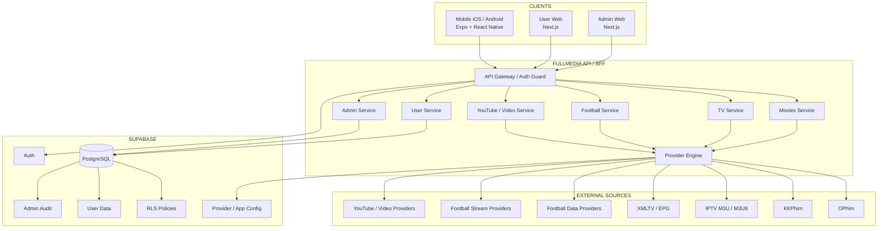

### Trách nhiệm từng tầng

**Clients** chỉ hiển thị canonical DTO và gọi API nội bộ FULLMEDIA. Không chứa provider credential và không hardcode schema nguồn.

**API/BFF** là boundary bắt buộc: auth, validation, rate limit, cache, provider selection, fallback, canonicalization, user context, audit và playback resolve.

**Provider Engine** giữ registry provider, health, circuit breaker, priority, mapping và fallback.

**Supabase** giữ identity, dữ liệu người dùng, provider config, feature flags, audit log và canonical/persisted data khi cần.

**External Sources** chỉ được truy cập bởi adapter/server-side integration phù hợp, ngoại trừ media bytes hợp lệ mà player có thể phát trực tiếp theo playback descriptor.

---

## 3. Monorepo mục tiêu

```text
fullmedia/
├── apps/
│   ├── mobile/
│   │   ├── src/features/movies/
│   │   ├── src/features/tv/
│   │   ├── src/features/football/
│   │   ├── src/features/youtube/
│   │   └── src/features/account/
│   ├── web/
│   ├── admin/
│   └── api/
│
├── packages/
│   ├── api-client/
│   ├── auth/
│   ├── config/
│   ├── contracts/
│   ├── database/
│   ├── design-tokens/
│   ├── providers/
│   │   ├── movies/
│   │   │   ├── ophim/
│   │   │   └── kkphim/
│   │   ├── tv/
│   │   ├── football/
│   │   └── video/
│   ├── playback/
│   ├── analytics/
│   ├── logger/
│   ├── ui/
│   ├── testing/
│   └── types/
│
├── supabase/
│   ├── migrations/
│   ├── seed/
│   └── functions/
│
└── docs/
```

Quy tắc: logic đặc thù provider không được rải trong `apps/mobile`, `apps/web` hoặc UI components.

---

## 4. Control Plane và Data Plane

### 4.1 Control Plane

Control Plane quyết định hệ thống phải hoạt động như thế nào.

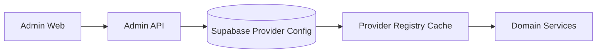

Dữ liệu control-plane gồm:

- `providers`
- `provider_configs`
- `provider_mappings`
- `provider_health`
- `feature_flags`
- `app_config`
- `home_sections`
- `admin_audit_logs`

Một thay đổi provider thông thường có flow:

```text
Admin
  → Edit provider config
  → Validate
  → Test provider
  → Save new config version
  → Write audit log
  → Invalidate registry/cache
  → API requests mới sử dụng config mới
```

### 4.2 Data Plane

Data Plane là metadata và playback data mà user thực sự tiêu thụ.

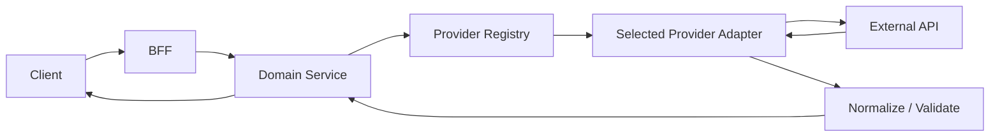

---

## 5. Canonical Contract

Client không nhận raw JSON của provider. Mọi adapter map dữ liệu về DTO chuẩn FULLMEDIA.

Ví dụ movie:

```ts
interface MovieSummary {
  id: string;
  title: string;
  originalTitle?: string;
  poster?: string;
  backdrop?: string;
  year?: number;
  type: 'movie' | 'series' | 'anime' | 'other';
  genres: string[];
  countries: string[];
  status?: string;
}
```

Flow chuẩn:

```text
OPhim JSON ──► OPhimAdapter ──┐
                              ├─► Canonical Movie DTO ─► Client
KKPhim JSON ─► KKPhimAdapter ─┘
```

Nguyên tắc tương tự áp dụng cho TV channel, EPG programme, football match, standings và video item.

---

## 6. Data Flow — Xem phim

### 6.1 Load trang Phim

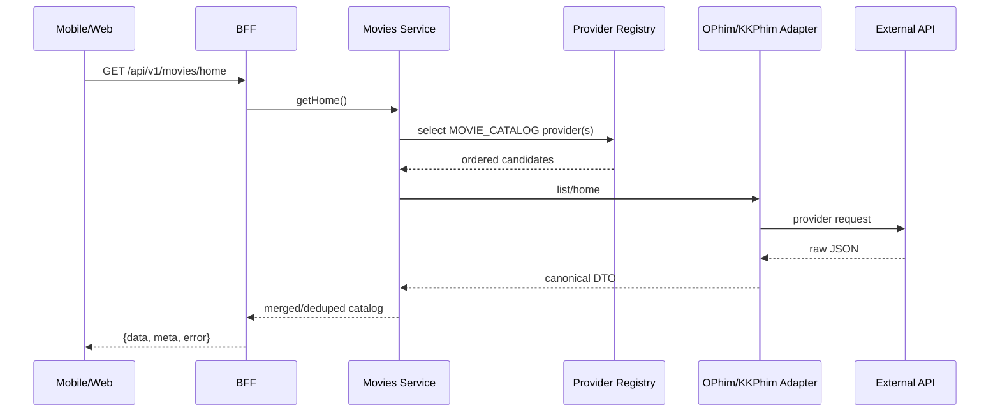

### 6.2 Search và detail

```text
GET /movies/search?q=
GET /movies/:id
GET /movies/:id/episodes
```

Search có thể fan-out sang nhiều provider khi cần, sau đó normalize + deduplicate theo canonical identity.

### 6.3 Playback phim

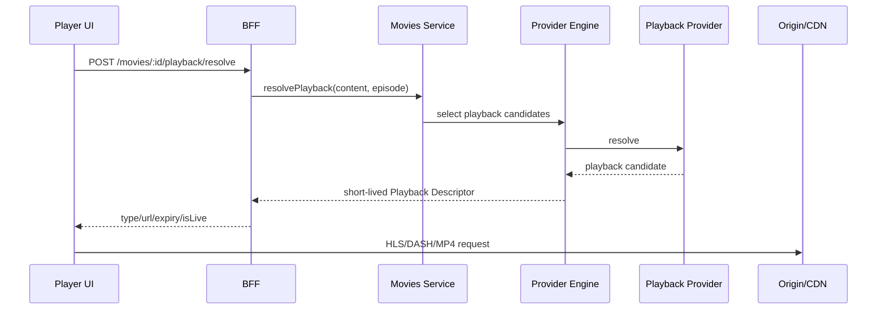

Playback descriptor không expose provider secret thô. Signed URL có TTL ngắn.

### 6.4 Fallback

```text
Provider A
  → timeout/5xx/retryable error
  → mark failure metric
  → Provider B
  → normalize
  → response
```

Không fallback vô hạn. Non-retryable error dừng pipeline ngay.

---

## 7. Data Flow — TV / IPTV

### 7.1 Ingest channel list

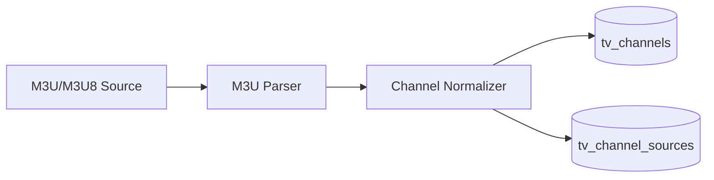

Một logical channel có thể có nhiều physical source:

```text
VTV3
 ├── Source A
 ├── Source B
 └── Source C
```

### 7.2 EPG

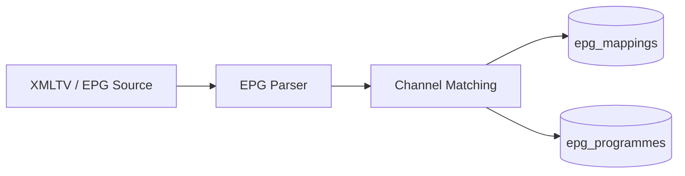

### 7.3 Client TV flow

```text
GET /tv/home
GET /tv/channels
GET /tv/channels/:id
GET /tv/channels/:id/epg
POST /tv/channels/:id/playback/resolve
```

Khi user đổi kênh trong Channel Drawer, app không cần thoát player; chỉ resolve descriptor của channel mới và thay media source.

### 7.4 TV playback failover

```text
Channel VTV3
   ↓
Source A → ERROR
   ↓
retry policy
   ↓
Source B → OK
   ↓
resume playback
```

---

## 8. Data Flow — Bóng đá

Football Data và Football Stream là hai provider family độc lập.

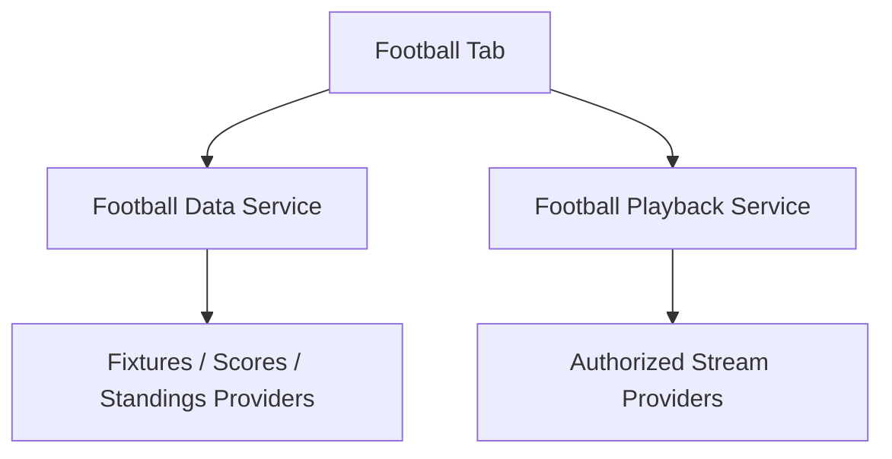

### 8.1 Match data

```text
GET /football/home?date=
GET /football/matches/:id
GET /football/competitions/:id/fixtures
GET /football/competitions/:id/standings
```

Canonical match nên có tối thiểu:

- match id
- competition
- home/away team
- kickoff timestamp
- status
- minute khi live
- score
- updatedAt/dataFreshness
- events/stats khi provider hỗ trợ

### 8.2 Playback bóng đá

```text
POST /football/matches/:id/playback/resolve
```

Nếu không có source hợp lệ, Match Center vẫn hoạt động đầy đủ với score/fixture/stats và **không render fake player**.

---

## 9. Data Flow — YouTube / Video Hub

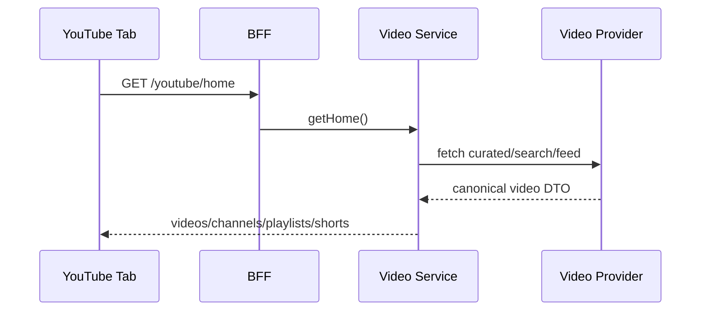

Playback dùng official/embed/player mechanism hoặc descriptor của provider hợp lệ. FULLMEDIA không re-host YouTube media và không xây cơ chế bypass quảng cáo/DRM.

---

## 10. Data Flow — Auth & User Data

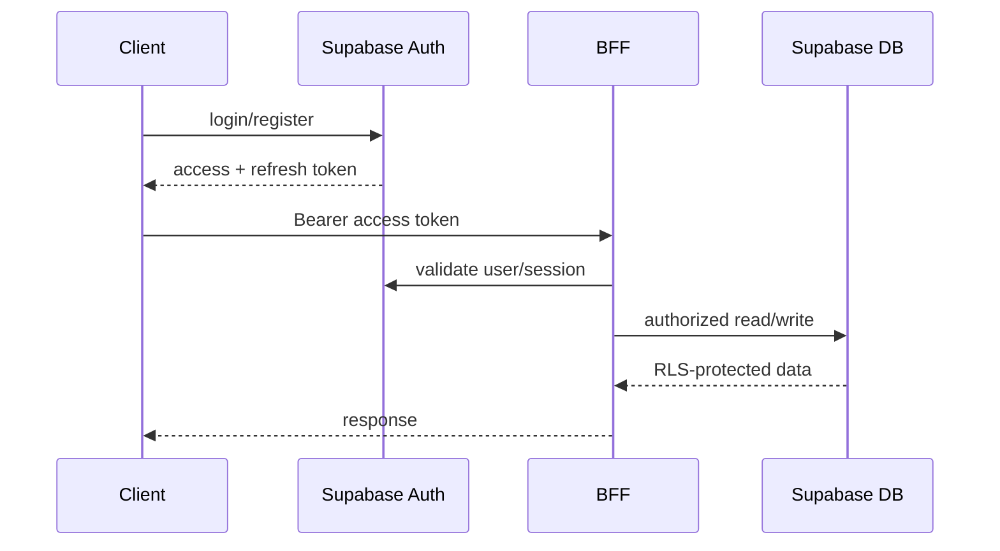

User-owned data:

```text
profiles
user_settings
devices
watch_history
favorites
watchlist
```

RLS bắt buộc cho dữ liệu user-owned. Provider secrets/config private không được client query trực tiếp.

---

## 11. Data Flow — Continue Watching

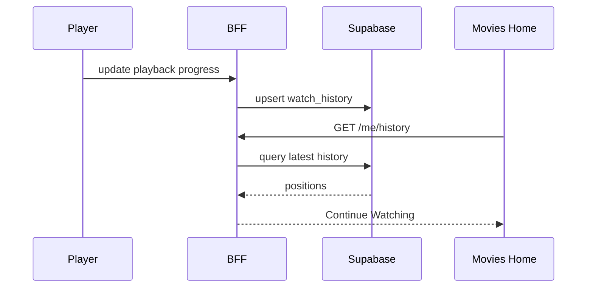

Update progress vào các thời điểm hợp lý: định kỳ, pause, background, episode change và player exit; không ghi DB mỗi frame/second.

---

## 12. Provider Selection & Circuit Breaker

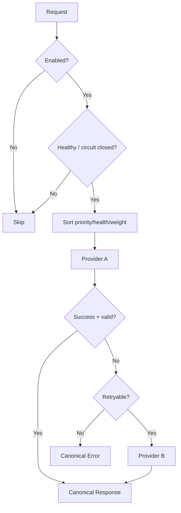

Health states:

```text
UNKNOWN → HEALTHY → DEGRADED → DOWN
                         ↑        │
                         └─ probe ┘

DISABLED là trạng thái do operator chủ động tắt.
```

Config registry tối thiểu:

```text
id
code
type
enabled
base_url
auth_strategy
encrypted_secret_ref
headers_template
priority
weight
timeout_ms
retry_policy
cache_ttl
mapping_version
health_status
config_version
```

---

## 13. Admin → Runtime Config Flow

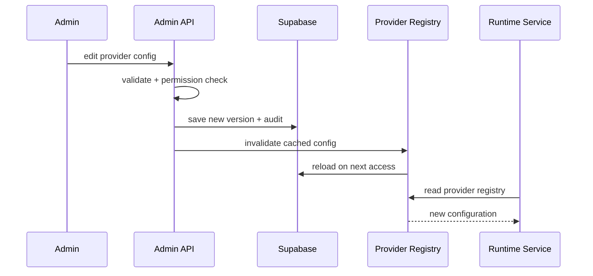

Ví dụ tắt KKPhim không yêu cầu build lại app:

```text
Admin → KKPhim → Enabled OFF
→ save
→ config version++
→ registry invalidate
→ requests mới không chọn KKPhim
```

---

## 14. Cache Architecture

Ba lớp cache:

```text
Client Query Cache
       ↓
BFF / Server Cache
       ↓
Provider / CDN Cache
```

TTL guideline ban đầu:

| Data | TTL gợi ý |
|---|---:|
| Genre/country taxonomy | 6–24 giờ |
| Movie home/catalog | 5–30 phút |
| Movie detail | 5–30 phút |
| IPTV channel list | 10–60 phút |
| EPG | 10–30 phút |
| Football fixtures | 1–5 phút |
| Live score | khoảng 10–30 giây tùy provider/rate limit |
| Provider config | 30–120 giây + explicit invalidation |
| Playback descriptor | rất ngắn / theo expiry |

Cache key provider nên chứa `provider_id + operation + normalized_params + config_version`.

---

## 15. Media Delivery Flow

Không dùng Vercel làm video proxy mặc định.

### Control request

```text
Client
  → FULLMEDIA BFF
  → Provider Engine
  → Playback provider
  → Playback Descriptor
  → Client
```

### Media request

```text
Player
  → Origin / CDN / Provider
  → HLS / DASH / MP4 segments
```

Lợi ích:

- giảm bandwidth Vercel;
- tránh serverless timeout;
- giảm latency;
- giảm một lớp lỗi;
- scale playback độc lập với API traffic.

---

## 16. API Boundary

Base path:

```text
/api/v1
```

Response chuẩn:

```json
{
  "data": {},
  "meta": {},
  "error": null
}
```

Nhóm endpoint:

```text
/movies/*
/tv/*
/football/*
/youtube/*
/me/*
/admin/*
```

External provider contract không được leak trực tiếp thành public API contract.

---

## 17. Database Relationship Sketch

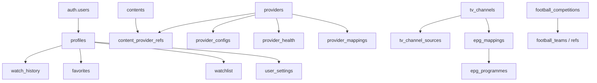

Không bắt buộc persist toàn bộ catalog từ mọi provider. Có thể persist canonical entity khi curated, sync hoặc khi user tương tác.

---

## 18. Observability Flow

Mỗi request quan trọng có:

```text
request_id
domain
operation
provider_id
config_version
latency_ms
status_class
fallback_count
error_class
```

Không log:

- access/refresh tokens;
- provider secrets;
- Authorization headers;
- signed playback URL đầy đủ;
- cookies nhạy cảm.

Metrics chính:

- API p50/p95 latency;
- provider error rate;
- provider health;
- fallback count;
- playback resolve latency;
- time-to-first-frame;
- buffering ratio;
- playback error rate.

---

## 19. Kiến trúc nguyên tắc bắt buộc

```text
UI
 ↓
Canonical Contract
 ↓
Domain Service
 ↓
Provider Engine
 ↓
Provider Adapter
 ↓
External Source
```

Không được rút ngắn thành:

```text
Screen → OPhim API
Screen → KKPhim API
Screen → M3U URL
```

Nếu external source đổi schema hoặc ngừng hoạt động, ưu tiên sửa `adapter/config/provider mapping`; không đẩy logic chữa cháy vào UI.

---

## 20. Phase mapping

- **P0:** dựng monorepo, contracts, database/config foundations.
- **P1:** Auth + app shell + 4 root navigation domains.
- **P2:** Provider Engine, registry, health, fallback, cache.
- **P3:** Movies data flow + OPhim/KKPhim.
- **P4:** TV ingest + EPG + playback flow.
- **P5:** Football data flow.
- **P6:** Football playback resolver.
- **P7:** YouTube/video flow.
- **P8:** Admin/control-plane complete.
- **P9:** Notifications/personalization.
- **P10:** Observability/performance.
- **P11:** Security/hardening.
- **P12:** Release.

---

## 21. Definition of Done cho Architecture/Data Flow

Kiến trúc chỉ được coi là được triển khai đúng khi:

- client không gọi trực tiếp external provider trong production flow;
- 4 domain có service boundary riêng;
- provider adapter trả canonical DTO;
- provider config đổi được từ Admin;
- provider health/fallback hoạt động và có giới hạn;
- secrets không xuất hiện trong client bundle/API response/log;
- RLS bảo vệ user-owned data;
- media không proxy qua Vercel mặc định;
- playback descriptor có expiry/validation phù hợp;
- provider outage không làm crash toàn app;
- source unavailable có empty/error state đúng UX từng domain;
- architecture tests/integration tests được thêm ở các phase tương ứng.
