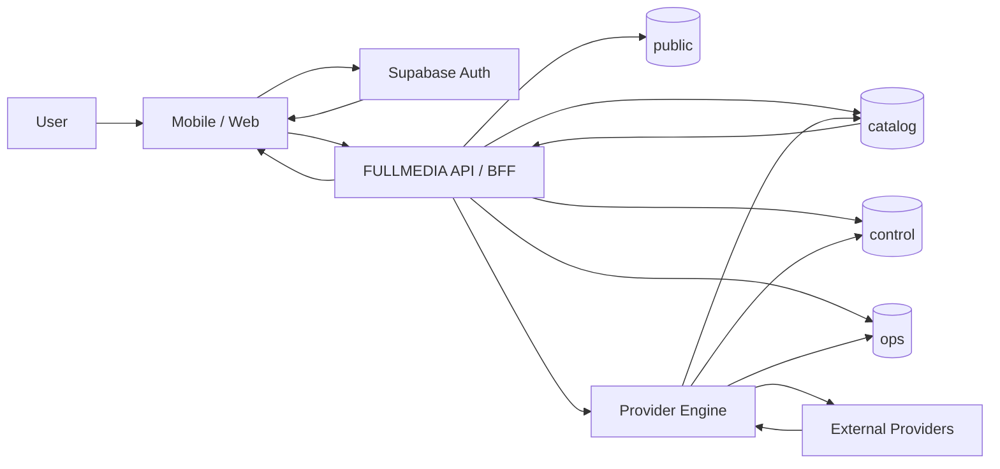

# 20 — Database Architecture (PostgreSQL / Supabase)

Tài liệu này chốt kiến trúc database production-ready cho FULLMEDIA. Database phải phục vụ Mobile iOS/Android, User Web, Admin Web, API/BFF và Provider Engine, đồng thời giữ được nguyên tắc: client không phụ thuộc provider schema, dữ liệu người dùng có RLS, provider secret không lộ ra client, và cấu hình nguồn có thể thay đổi từ Admin mà không cần đổi kiến trúc app.

---

## 1. Mục tiêu

Database phải hỗ trợ:

- Supabase Auth cho đăng ký/đăng nhập.
- Hồ sơ, cài đặt, thiết bị, lịch sử xem, yêu thích, watchlist.
- Canonical content cho Movies / TV / Football / YouTube.
- Mapping nhiều provider vào một entity nội bộ.
- IPTV channels + EPG.
- Football fixtures, scores, standings, match events.
- Video/channel/playlist metadata.
- Provider configuration động.
- Feature flags, app config, home sections.
- Provider health, ingestion, playback telemetry, audit logs.
- Không lưu secret/API key plaintext trong bảng public.
- Migration là source of truth.

---

## 2. Phân chia schema

```text
PostgreSQL / Supabase

auth/
  users                      Supabase quản lý

public/
  profiles
  user_settings
  devices
  watch_history
  favorites
  watchlist
  notification_preferences

catalog/
  entities
  provider_refs
  genres
  media_titles
  media_title_genres
  media_seasons
  media_episodes
  tv_channel_groups
  tv_channels
  epg_programmes
  football_competitions
  football_teams
  football_matches
  football_match_events
  football_standings
  video_channels
  video_items
  video_playlists
  video_playlist_items

control/
  admin_memberships
  providers
  provider_configs
  provider_mappings
  provider_capabilities
  feature_flags
  app_config
  home_sections
  iptv_playlists
  playback_bindings

ops/
  provider_health
  provider_health_events
  ingestion_runs
  sync_cursors
  playback_sessions
  playback_events
  admin_audit_logs
```

### Exposure rule

- `public.*`: có thể được client dùng trực tiếp qua Supabase nhưng bắt buộc RLS.
- `catalog.*`: ưu tiên truy cập qua FULLMEDIA API/BFF; chỉ expose safe views khi thật sự cần.
- `control.*`: chỉ backend/Admin server truy cập.
- `ops.*`: chỉ backend/worker/Admin server truy cập.
- `auth.*`: Supabase quản lý.

---

## 3. User identity

Không tạo bảng `users` riêng. `auth.users.id` là identity gốc.

### public.profiles

```sql
create table public.profiles (
    id uuid primary key references auth.users(id) on delete cascade,
    display_name text,
    username text,
    avatar_url text,
    locale text default 'vi-VN',
    timezone text default 'Asia/Ho_Chi_Minh',
    created_at timestamptz not null default now(),
    updated_at timestamptz not null default now()
);
```

Không dùng `profiles.role` làm nguồn authorization Admin.

### public.user_settings

Các field chính:

- `user_id`
- `autoplay_next`
- `autoplay_preview`
- `data_saver`
- `default_video_quality`
- `subtitle_language`
- `audio_language`
- `football_notifications`
- `movie_notifications`
- `tv_autoplay`
- `youtube_autoplay`
- `privacy_json`
- timestamps

### public.devices

Dùng cho push/device management:

- `id`
- `user_id`
- `platform`
- `device_name`
- `push_token`
- `app_version`
- `os_version`
- `last_seen_at`
- timestamps

Unique hợp lý: `(user_id, push_token)`.

---

## 4. Canonical entity layer

Không để business logic phụ thuộc `ophim_id`, `kkphim_id`, football provider ID hay YouTube provider ID.

### catalog.entities

```sql
create table catalog.entities (
    id uuid primary key default gen_random_uuid(),
    domain text not null,
    entity_type text not null,
    canonical_key text,
    title text,
    image_url text,
    metadata jsonb not null default '{}'::jsonb,
    is_active boolean not null default true,
    created_at timestamptz not null default now(),
    updated_at timestamptz not null default now(),
    unique(domain, canonical_key)
);
```

Ví dụ domain/entity type:

- `MOVIES / MOVIE`
- `MOVIES / SERIES`
- `TV / CHANNEL`
- `FOOTBALL / TEAM`
- `FOOTBALL / MATCH`
- `YOUTUBE / VIDEO`

`favorites`, `watch_history`, analytics, home sections và playback bindings có thể tham chiếu canonical entity này.

### catalog.provider_refs

Một entity có thể map tới nhiều provider:

- `id`
- `entity_id`
- `provider_id`
- `external_id`
- `external_slug`
- `external_url_hash`
- `metadata_json`
- `metadata_hash`
- `last_synced_at`
- timestamps

Unique: `(provider_id, external_id)`.

Ví dụ một phim FULLMEDIA có thể có cả OPhim ref và KKPhim ref.

---

## 5. Movies domain

### catalog.media_titles

```text
id UUID PK/FK entities.id
media_type        MOVIE | SERIES | ANIME | TV_SHOW
original_title
normalized_title
overview
release_year
release_date
status
runtime_minutes
poster_url
backdrop_url
age_rating
country_codes[]
language_codes[]
metadata jsonb
created_at
updated_at
```

### catalog.genres

- `id`
- `slug`
- `name`
- `domain`

### catalog.media_title_genres

Join table, unique `(title_id, genre_id)`.

### catalog.media_seasons

- `id`
- `title_id`
- `season_number`
- `name`
- `overview`
- `poster_url`
- `episode_count`
- `air_date`
- `metadata`

Unique `(title_id, season_number)`.

### catalog.media_episodes

- `id`
- `title_id`
- `season_id nullable`
- `episode_number`
- `provider_episode_key`
- `name`
- `overview`
- `thumbnail_url`
- `duration_seconds`
- `air_date`
- `metadata`
- timestamps

Index `(title_id, episode_number)`.

---

## 6. User activity

### public.watch_history

```sql
create table public.watch_history (
    id uuid primary key default gen_random_uuid(),
    user_id uuid not null references auth.users(id) on delete cascade,
    entity_id uuid not null,
    episode_id uuid,
    position_seconds integer not null default 0,
    duration_seconds integer,
    completed boolean not null default false,
    last_watched_at timestamptz not null default now(),
    created_at timestamptz not null default now(),
    updated_at timestamptz not null default now()
);
```

Unique logic theo `user + entity + episode`.

Index bắt buộc:

```sql
create index idx_watch_history_user_recent
on public.watch_history(user_id, last_watched_at desc);
```

### public.favorites

- `id`
- `user_id`
- `entity_id`
- `created_at`

Unique `(user_id, entity_id)`.

Có thể favorite movie, TV channel, football team, competition, video/channel mà không cần nhiều bảng favorite riêng.

### public.watchlist

- `id`
- `user_id`
- `entity_id`
- `created_at`

Dùng chủ yếu cho Movie / Series / Anime.

---

## 7. TV / IPTV domain

### catalog.tv_channel_groups

- `id`
- `slug`
- `name`
- `sort_order`
- `is_active`

Ví dụ: VTV, HTV, VTC, THVL, Thể thao, Phim, Thiếu nhi, Quốc tế.

### catalog.tv_channels

```text
id UUID PK/FK entities.id
name
short_name
logo_url
group_id
country_code
language_code
is_hd
is_active
sort_order
metadata
created_at
updated_at
```

Không lưu private stream URL trực tiếp ở bảng channel.

### control.playback_bindings

```text
id
entity_id
provider_id
binding_type      IPTV_STREAM | MOVIE_STREAM | FOOTBALL_STREAM | VIDEO_STREAM
source_key
source_ref
secret_ref
priority
weight
headers_template jsonb
starts_at
expires_at
enabled
created_at
updated_at
```

Một channel có thể có nhiều playback binding để fallback.

### control.iptv_playlists

```text
id
provider_id
name
source_type       M3U_URL | M3U_FILE
source_ref
secret_ref
epg_source_ref
enabled
refresh_interval_minutes
last_sync_at
next_sync_at
created_at
updated_at
```

### catalog.epg_programmes

```text
id
channel_id
external_id
title
description
starts_at
ends_at
category
poster_url
metadata
created_at
```

Index:

```sql
create index idx_epg_channel_time
on catalog.epg_programmes(channel_id, starts_at, ends_at);
```

---

## 8. Football domain

### catalog.football_competitions

- `id UUID PK/FK entities.id`
- `name`
- `short_name`
- `country_code`
- `logo_url`
- `competition_type`
- `current_season`
- `metadata`

### catalog.football_teams

- `id UUID PK/FK entities.id`
- `name`
- `short_name`
- `logo_url`
- `country_code`
- `venue_name`
- `metadata`

### catalog.football_matches

```text
id UUID PK/FK entities.id
competition_id
season
home_team_id
away_team_id
kickoff_at
status
minute
home_score
away_score
home_score_ht
away_score_ht
winner_team_id
venue
data_updated_at
metadata
```

Status dự kiến:

`SCHEDULED, PRE_MATCH, LIVE, HALFTIME, FINISHED, POSTPONED, CANCELLED, SUSPENDED`.

Index quan trọng:

- `(kickoff_at)`
- `(competition_id, kickoff_at)`
- `(status, kickoff_at)`
- `(home_team_id, kickoff_at)`
- `(away_team_id, kickoff_at)`

Partial index:

```sql
create index idx_live_matches
on catalog.football_matches(kickoff_at)
where status in ('LIVE', 'HALFTIME');
```

### catalog.football_match_events

- `id`
- `match_id`
- `provider_event_id`
- `minute`
- `added_time`
- `event_type`
- `team_id`
- `player_name`
- `detail`
- `sort_order`
- `metadata`

Event type ví dụ: GOAL, OWN_GOAL, PENALTY, YELLOW_CARD, RED_CARD, SUBSTITUTION, VAR.

### catalog.football_standings

- `id`
- `competition_id`
- `season`
- `team_id`
- `position`
- `played`
- `won`
- `drawn`
- `lost`
- `goals_for`
- `goals_against`
- `goal_difference`
- `points`
- `form`
- `updated_at`

Unique `(competition_id, season, team_id)`.

---

## 9. YouTube / Video domain

Chỉ canonicalize metadata FULLMEDIA thực sự dùng; không clone toàn bộ YouTube.

### catalog.video_channels

- `id UUID PK/FK entities.id`
- `provider_id`
- `external_channel_id`
- `title`
- `avatar_url`
- `banner_url`
- `subscriber_count`
- `metadata`
- `updated_at`

### catalog.video_items

```text
id UUID PK/FK entities.id
channel_id
external_video_id
video_type      VIDEO | SHORT | LIVE
title
description
thumbnail_url
duration_seconds
published_at
view_count
embeddable
metadata
created_at
updated_at
```

Không lưu binary video.

### catalog.video_playlists

- `id UUID PK/FK entities.id`
- `channel_id`
- `external_playlist_id`
- `title`
- `description`
- `thumbnail_url`
- `metadata`

### catalog.video_playlist_items

- `playlist_id`
- `video_id`
- `position`

Unique `(playlist_id, video_id)`.

---

## 10. Provider Control Plane

### control.providers

```text
id UUID
code
display_name
provider_type
enabled
priority
weight
health_strategy
created_at
updated_at
```

Ví dụ: OPHIM, KKPHIM, IPTV_VN_01, FOOTBALL_API_01, FOOTBALL_STREAM_01, YOUTUBE.

### control.provider_configs

```text
id
provider_id
base_url
auth_strategy
secret_ref
headers_template jsonb
request_template jsonb
timeout_ms
retry_policy jsonb
cache_ttl_seconds
mapping_version
config_version
created_at
updated_at
```

Không lưu API key plaintext. Chỉ lưu `secret_ref`, actual secret nằm trong Vault/server secret manager.

### control.provider_mappings

Cho phép sửa mapping upstream mà không thay client:

- `id`
- `provider_id`
- `domain`
- `operation`
- `mapping_version`
- `mapping_json`
- `enabled`
- timestamps

### control.provider_capabilities

- `provider_id`
- `capability`
- `enabled`

Ví dụ OPhim có `MOVIE_LIST`, `MOVIE_SEARCH`, `MOVIE_DETAIL`, `MOVIE_PLAYBACK`.

---

## 11. Provider health / circuit breaker

### ops.provider_health

```text
provider_id PK
health_status
last_checked_at
last_success_at
last_failure_at
latency_ms
consecutive_successes
consecutive_failures
circuit_open_until
last_error_code
last_error_message
```

Health state: `UNKNOWN, HEALTHY, DEGRADED, DOWN, DISABLED`.

### ops.provider_health_events

- `id`
- `provider_id`
- `status`
- `latency_ms`
- `http_status`
- `error_class`
- `created_at`

Retention gợi ý: 30–90 ngày.

---

## 12. Feature flags và app config

### control.feature_flags

```text
id
key unique
enabled
platforms jsonb
min_app_version
max_app_version
rollout_percent
config jsonb
created_at
updated_at
```

Ví dụ: `football_streaming`, `youtube_shorts`, `new_tv_player`, `movie_autoplay`.

### control.app_config

```text
key PK
value jsonb
schema_version
updated_at
```

Ví dụ: maintenance mode, minimum app version, support URL, default cache TTL, player config.

### control.home_sections

Vì 4 tab thiết kế riêng nên section phải có domain riêng:

```text
id
domain
section_type
title
sort_order
enabled
query_config jsonb
display_config jsonb
starts_at
ends_at
created_at
updated_at
```

Ví dụ:

- `MOVIES / HERO`
- `MOVIES / CONTINUE_WATCHING`
- `TV / FAVORITE_CHANNELS`
- `FOOTBALL / LIVE_MATCHES`
- `YOUTUBE / TRENDING_VIDEO`

---

## 13. Admin authorization và audit

### control.admin_memberships

```text
user_id
role        SUPPORT | EDITOR | ADMIN | SUPER_ADMIN
is_active
created_at
updated_at
```

Authorization phải verify server-side.

### ops.admin_audit_logs

```text
id
actor_user_id
action
resource_type
resource_id
before_json
after_json
request_id
ip_hash
created_at
```

Secret phải redact trước khi ghi.

---

## 14. Ingestion / sync

### ops.ingestion_runs

```text
id
domain
provider_id
operation
started_at
finished_at
status
records_received
records_created
records_updated
records_skipped
error_count
cursor_before
cursor_after
metadata
```

Status: `RUNNING, SUCCESS, PARTIAL, FAILED, CANCELLED`.

### ops.sync_cursors

- `provider_id`
- `sync_type`
- `cursor`
- `last_sync_at`

Unique `(provider_id, sync_type)`.

---

## 15. Playback telemetry

### ops.playback_sessions

Không lưu signed stream URL.

```text
id
user_id nullable
entity_id
episode_id nullable
domain
provider_id
platform
started_at
ended_at
startup_ms
buffer_seconds
completion_percent
final_state
error_code
```

### ops.playback_events

- `id`
- `session_id`
- `event_type`
- `position_seconds`
- `metadata`
- `created_at`

Event ví dụ: PLAY, PAUSE, BUFFER_START, BUFFER_END, SOURCE_SWITCH, ERROR, ENDED.

---

## 16. Notifications

### public.notification_preferences

```text
user_id
movie_updates
favorite_team_matches
match_start
tv_program_reminders
product_updates
quiet_hours_start
quiet_hours_end
updated_at
```

Có thể bổ sung `notification_subscriptions` cho TEAM / COMPETITION / MOVIE / SERIES / TV_PROGRAMME.

---

## 17. RLS strategy

Tất cả bảng user-owned trong `public` bắt buộc bật RLS.

### profiles

```sql
alter table public.profiles enable row level security;

create policy "profile_select_own"
on public.profiles
for select
to authenticated
using (id = auth.uid());

create policy "profile_update_own"
on public.profiles
for update
to authenticated
using (id = auth.uid())
with check (id = auth.uid());
```

Áp dụng cùng nguyên tắc cho:

- `watch_history`
- `favorites`
- `watchlist`
- `devices`
- `user_settings`
- `notification_preferences`

`control.*` và `ops.*` không cấp quyền trực tiếp cho `anon`/`authenticated`.

`service_role` chỉ tồn tại server-side.

---

## 18. Grants

RLS không thay thế GRANT. Cần revoke/grant có chủ đích.

Ví dụ:

```sql
revoke all on public.watch_history from anon, authenticated;
grant select, insert, update, delete on public.watch_history to authenticated;
```

RLS sau đó giới hạn row theo `auth.uid()`.

---

## 19. Secret strategy

Không thiết kế:

```text
providers.api_key text
```

Thiết kế:

```text
provider_configs.secret_ref
      ↓
Supabase Vault / server secret manager
      ↓
actual secret
```

Không bao giờ đưa service role/provider secret vào Expo bundle, browser, `NEXT_PUBLIC_*` hoặc `EXPO_PUBLIC_*`.

---

## 20. updated_at trigger

Dùng function chung:

```sql
create or replace function public.set_updated_at()
returns trigger
language plpgsql
as $$
begin
    new.updated_at = now();
    return new;
end;
$$;
```

Áp dụng cho các bảng cần `updated_at`.

---

## 21. User signup bootstrap

Flow chuẩn:

```text
Supabase Auth signup
       ↓
auth.users INSERT
       ↓
handle_new_user()
       ↓
profiles
user_settings
notification_preferences
```

Không để mobile phải tự tạo từng row sau signup.

---

## 22. Search/indexing

Movies search nên hỗ trợ `pg_trgm` + `unaccent` và có thể bổ sung FTS.

Ví dụ:

```sql
create index idx_media_title_search
on catalog.media_titles
using gin (normalized_title gin_trgm_ops);
```

Index chính:

- watch history: `(user_id, last_watched_at desc)`
- favorites: unique `(user_id, entity_id)`
- provider refs: unique `(provider_id, external_id)` + `(entity_id)`
- episodes: `(title_id, episode_number)`
- TV: `(group_id, sort_order)`
- EPG: `(channel_id, starts_at, ends_at)`
- football: `(kickoff_at)`, `(status, kickoff_at)`, `(competition_id, kickoff_at)`
- video: `(channel_id, published_at desc)`
- provider health: `(health_status)`, `(last_checked_at)`

---

## 23. JSONB rules

Dùng JSONB cho:

- provider-specific metadata
- remote config
- mapping definitions
- retry policy
- headers template
- analytics metadata

Không dùng JSONB thay thế column nếu field thường xuyên filter/sort/index.

---

## 24. Soft delete

Provider và canonical content nên ưu tiên:

- `is_active`
- `disabled_at`
- `deleted_at`

thay vì hard delete, nhằm giữ watch history, audit log và khả năng rollback.

---

## 25. Provider ingestion strategy

Không cần clone toàn bộ OPhim/KKPhim vào Supabase.

Hybrid strategy:

```text
External Provider
    ↓
Provider Engine
    ↓
server cache
    ↓
canonical response
```

Persist khi:

- featured/curated content
- user tương tác
- watch history/watchlist/favorite
- Admin curation
- scheduled hot catalog sync

---

## 26. Movie deduplication

Dùng `normalized_title + year + type` cùng metadata hỗ trợ để match nhiều provider về một canonical entity.

Ví dụ:

```text
canonical movie A
   ├── provider_ref OPhim
   └── provider_ref KKPhim
```

Case mơ hồ phải cho phép Admin review/merge thay vì tự merge sai.

---

## 27. IPTV ingestion

```text
M3U
 ↓
Parser
 ↓
normalize tvg-id/name/logo/group
 ↓
Channel Matcher
 ↓
catalog.tv_channels
 ↓
control.playback_bindings
```

Playlist sync không xóa channel ngay nếu provider trả thiếu một lần. Nên chuyển trạng thái theo `active -> stale -> disabled` qua nhiều vòng sync.

---

## 28. Football ingestion

```text
Football API
 ↓
Competition mapping
 ↓
Team mapping
 ↓
Match mapping
 ↓
football_matches
 ↓
match events / standings
```

Live state update row hiện tại thay vì insert snapshot mới mỗi giây. Historical events persist riêng.

---

## 29. Cron / scheduled jobs

Dự kiến:

- provider health: mỗi 1–5 phút
- football upcoming sync: mỗi 5–15 phút
- football live sync: nhanh hơn khi có trận live
- EPG refresh: mỗi vài giờ
- IPTV playlist refresh: theo provider
- telemetry cleanup: daily
- stale content cleanup: daily/weekly

Nên có jitter/batching để tránh tất cả provider chạy cùng lúc.

---

## 30. Data retention

Gợi ý:

| Dữ liệu | Retention |
|---|---|
| User profile | đến khi account bị xóa |
| Watch history | user kiểm soát |
| Favorites/watchlist | user kiểm soát |
| Provider health events | 30–90 ngày |
| Playback raw events | 30–90 ngày |
| Aggregated analytics | dài hơn |
| Admin audit | tối thiểu 1 năm |
| Failed ingestion logs | 30–90 ngày |
| EPG quá khứ | khoảng 7–30 ngày |

---

## 31. Migration architecture

Không chỉnh production DB thủ công. Migration là source of truth.

```text
supabase/
  migrations/
    0001_extensions.sql
    0002_schemas.sql
    0003_user_tables.sql
    0004_catalog_core.sql
    0005_movies.sql
    0006_tv.sql
    0007_football.sql
    0008_video.sql
    0009_provider_control.sql
    0010_operations.sql
    0011_rls.sql
    0012_indexes.sql
    0013_triggers.sql
    0014_seed_reference.sql
```

Production không seed fake movies, fake matches, fake channels hoặc fake users.

---

## 32. Data flow tổng thể



---

## 33. ER overview

```mermaid
erDiagram
    AUTH_USERS ||--|| PROFILES : owns
    AUTH_USERS ||--|| USER_SETTINGS : owns
    AUTH_USERS ||--o{ DEVICES : has
    AUTH_USERS ||--o{ WATCH_HISTORY : creates
    AUTH_USERS ||--o{ FAVORITES : creates
    AUTH_USERS ||--o{ WATCHLIST : creates

    ENTITIES ||--o{ PROVIDER_REFS : maps
    ENTITIES ||--o| MEDIA_TITLES : movie
    ENTITIES ||--o| TV_CHANNELS : tv
    ENTITIES ||--o| FOOTBALL_TEAMS : team
    ENTITIES ||--o| FOOTBALL_MATCHES : match
    ENTITIES ||--o| VIDEO_ITEMS : video

    MEDIA_TITLES ||--o{ MEDIA_SEASONS : contains
    MEDIA_TITLES ||--o{ MEDIA_EPISODES : contains
    TV_CHANNELS ||--o{ EPG_PROGRAMMES : schedules

    FOOTBALL_COMPETITIONS ||--o{ FOOTBALL_MATCHES : contains
    FOOTBALL_MATCHES ||--o{ FOOTBALL_MATCH_EVENTS : events

    VIDEO_CHANNELS ||--o{ VIDEO_ITEMS : publishes
    VIDEO_PLAYLISTS ||--o{ VIDEO_PLAYLIST_ITEMS : contains

    PROVIDERS ||--|| PROVIDER_CONFIGS : configured
    PROVIDERS ||--o{ PROVIDER_REFS : maps
    PROVIDERS ||--o{ PROVIDER_MAPPINGS : maps
    PROVIDERS ||--o{ PROVIDER_HEALTH_EVENTS : monitored

    ENTITIES ||--o{ PLAYBACK_BINDINGS : playback
    PROVIDERS ||--o{ PLAYBACK_BINDINGS : serves
```



---

## 34. Các nguyên tắc bắt buộc phải giữ

- Không tạo business table kiểu `ophim_movies`, `kkphim_movies`, `football_api_x_matches`.
- Client không biết provider schema.
- Provider không sở hữu user data.
- Stream URL không phải business entity.
- Auth user ID không do client tự sinh.
- Provider secret không bao giờ public.
- Bảng user-owned luôn có RLS.
- Admin mutation luôn có audit.
- Provider config luôn version được.
- Migrations là source of truth.
- Canonical IDs là nền tảng cho toàn hệ thống.

---

## 35. Kiến trúc cuối cùng

```text
                    AUTH
                     │
                     ▼
                 auth.users
                     │
          ┌──────────┴──────────┐
          ▼                     ▼
      USER DATA              ADMIN
       public.*                 │
                                ▼
                           control.*

EXTERNAL SOURCES
       │
       ▼
 PROVIDER ENGINE
       │
       ├──────────► ops.*
       │
       ▼
 canonicalization
       │
       ▼
    catalog.*
       │
       ▼
    API / BFF
       │
       ▼
iOS / Android / Web
```

Thiết kế này phải được dùng làm source of truth cho các migration Supabase và mọi service repository tiếp theo của FULLMEDIA.
